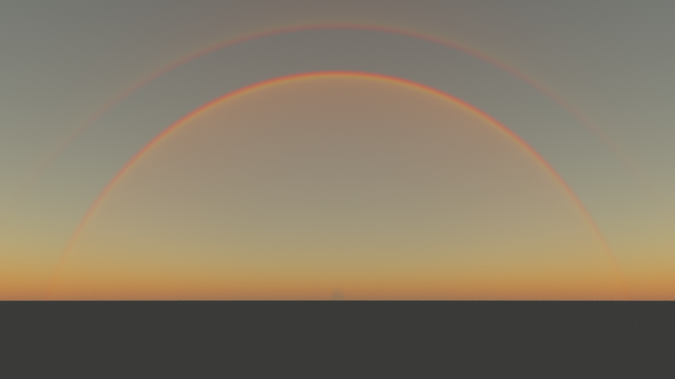

# Vulkanic

A lightweight, purely native C++26 Vulkan **real-time polarized-sky simulator**. **Vulkanic**
renders the daytime sky as a thirteen-band spectral Stokes-vector successive-order scattering
problem — Rayleigh + Lorenz–Mie — then converts CIE XYZ to display RGB after a runtime camera
analyzer that switches between linear and elliptical polarization.



*Vulkanic dawn/dusk render: coupled air/rain multiple scattering, atmospheric refraction and spherical droplets.
[Capture settings](docs/images/README.md).*

[Build](#building) · [Controls](#runtime-controls) · [Configuration](#runtime-configuration) · [Benchmarking](#benchmarking)

---

## Project Overview (STAR)

### Situation

Most renderers treat polarization as a post-process trick or ignore it entirely, and the sky as a
flat gradient or scalar single-scattering model. Scientific polarized-sky models usually live
offline in radiative-transfer packages. Vulkanic bridges that gap: a readable native Vulkan
program that interactively explores *physically motivated* sky polarization and how an ideal
analyzer responds to it.

### Task

Build a complete, runnable real-time simulator that:

- Targets a raw Vulkan compute pipeline on Windows.
- Uses Win32 directly for the window/input layer and keeps math/config parsing in-repo; CMake fetches
  `vk-bootstrap` for Vulkan bootstrap setup and Vulkan Memory Allocator for buffer allocation.
- Carries the full Stokes vector (I, Q, U, V) through the atmosphere at thirteen wavelengths from
  400–700 nm, rather than transporting display RGB.
- Lets the user aim the camera around the sky dome and switch between linear and elliptical analyzer
  modes at runtime.

### Action

The repository implements the whole stack from the OS layer up:

- **Polarized vector radiative transfer** (`shaders/transport.comp`) — Rayleigh scattering with molecular
  depolarization and a CPU-baked **Lorenz–Mie** aerosol scattering matrix (boundary-layer haze,
  conservative scattering). Everything is transported as Stokes vectors with proper Mueller
  matrices and frame rotations through up to four scattering events, including rain-to-rain
  and mixed air/rain paths under the same atmosphere integration controls.
- **Spectral colour pipeline** — thirteen 25 nm bands drive wavelength-scaled Rayleigh extinction,
  wavelength-resolved Mie matrices, and a Planck solar spectrum. CIE 1931 XYZ integration and
  linear-sRGB conversion happen only after atmospheric transport and polarization analysis.
- **Temporal accumulation** — stationary-camera linear-HDR accumulation reduces Monte Carlo noise
  from subpixel and scattering-direction sampling, and resets whenever the view, analyzer,
  or radiance configuration changes.
- **Atmospheric refraction** — numerically integrated rays through a height-dependent refractive
  index, cached in a CPU-calculated ray table and reused for camera, solar and scattered paths.
  Refracted sunlight and Earth occlusion follow those trajectories. A configurable spectrally neutral
  Lambertian lower boundary reflects attenuated direct sunlight and feeds the polarized
  successive-order atmosphere.
- **Polarized rainbow** — ray-traced spherical water droplets, a six-component
  Mueller table, and a cross-section-weighted log-normal size population. Primary and secondary
  bows, reflection and transmission participate in the coupled air/rain transport. The solar
  disk is integrated as illumination instead of being repeatedly blurred into the phase table.
- **Runtime polarization analyzer** — an ideal elliptical analyzer applied per band in the
  compute shader; `P` enables it, `C` switches linear/elliptical, `[` / `]` rotate the axis
  or sweep ellipticity.
- **From-scratch numerics** — a hand-written Lorenz–Mie solver (`src/sky/MieScattering.cpp`) bakes the
  scattering-matrix table at startup; a hand-written JSON parser (`src/config/RuntimeConfig.cpp`) loads the
  tunable parameters.
- **Hot config reload** — `path_tracer_config.json` is polled each frame; sky/aerosol edits apply
  live (aerosol changes rebuild the Mie table).
- **Compute pipeline** — an 8×8-tiled transport pass evaluates the sky into a persistent HDR
  accumulation buffer; four-wavelength packets share geometric work without dropping spectral bands.
  A second compute pass applies camera exposure and tone mapping before
  writing the swapchain storage image. There is still no scene geometry, acceleration structure,
  or RT-hardware requirement.

### Result

A compact repository whose only job is to render the polarized sky and let you study it:

- One executable, one config file. Run `scripts/build.ps1` and you can look around a physically motivated
  polarized sky.
- The analyzer toggles live between linear and elliptical, making the renderer useful for studying
  the Rayleigh polarization band, neutral points, and analyzer response.
- Each shader and module documents the model it implements at the top.

---

## System Requirements

- **OS:** Windows 10 / 11 (uses `VK_USE_PLATFORM_WIN32_KHR`).
- **GPU:** any Vulkan 1.2+ GPU with a compute queue, a storage-image-capable swapchain, and
  `shaderStorageImageWriteWithoutFormat` support (no hardware ray tracing required).
- **Vulkan SDK:** installed and exposed via the `VULKAN_SDK` environment variable.
- **Compiler:** a C++26-capable toolchain — MSVC via Visual Studio is the tested path.
- **CMake:** 3.25 or newer (required for C++26 standard selection).
- **Network during first configure:** CMake fetches `vk-bootstrap` and Vulkan Memory Allocator unless
  they are already present in the build cache.

## Building

The provided PowerShell script sets up the MSVC environment and (optionally) `sccache`:

```powershell
# from the project root, in a PowerShell terminal
.\scripts\build.ps1
```

For a clean rebuild:

```powershell
powershell -ExecutionPolicy Bypass -File .\scripts\build.ps1 -Clean
```

Or build manually with CMake. The project uses the Ninja generator in the script, but any generator
with a working C++26 toolchain and Vulkan SDK can work:

```bash
mkdir build
cd build
cmake ..
cmake --build .
```

The build script defaults to Release. Shaders use `-O` outside Debug;
Debug uses `-g -O0`, and RelWithDebInfo uses `-g -O`. Generated shaders live
under `shaders/<configuration>` in the build directory and are copied beside
the executable on every target build, including shader-only rebuilds.
Use Release when comparing frame times, with identical
camera and sampling settings and enough warm-up time for pipeline creation.

## Benchmarking

Use a fixed camera and config to compare GPU work independently of window-title FPS:

```powershell
.\cmake-build-ninja\Vulkanic.exe --benchmark 120 --warmup 120 --config .\config\path_tracer_config.json
```

This mode disables camera input, the GUI, config hot reload, and config save/cycle
shortcuts. After warm-up it records Vulkan timestamps for the sky/rainbow and
display passes, prints their mean, median and p95 in milliseconds, then exits.
The selected GPU and actual render extent are printed with the results. Timestamp
queries and their pipeline synchronization are enabled only in benchmark mode;
these are per-pass GPU timings, not end-to-end frame times. Other GPU workloads
and clock changes can affect them, so alternate baseline and candidate runs.

Add `--capture-hdr frame.hdrbin` to save the final linear-HDR accumulation for
numerical comparison. Use identical config, warm-up and measured frame counts
for both runs; the accumulated image includes warm-up frames. The binary format
is two little-endian `uint32` dimensions followed by row-major little-endian
`float32` tuples `(R, G, B, accumulated sample-frame count)` per pixel, before
exposure and tonemapping. Compare two captures with the standard-library-only tool:

```powershell
python .\scripts\compare-hdr.py baseline.hdrbin candidate.hdrbin
```

The tool rejects non-finite data, mismatched dimensions or accumulation counts,
and RGB components outside `2e-6 + 2e-4 * abs(reference)` by default. It reports
the actual errors and exits nonzero on failure. `--atol` and `--rtol` adjust
the tolerances when a different validation criterion is needed.

## Runtime Controls

- Hold right mouse button and move the mouse to look around the sky.
- Arrow keys look around without the mouse. `R` resets the camera to the JSON view.
- The Dear ImGui overlay adjusts exposure, aerosol density, and integration steps.
  Press `F1` to hide or show it.
- `F2` switches to the next JSON config discovered alongside the active config.
- `F5` saves the current GUI-adjusted settings back to the active config file.
- `P` toggles the polarization analyzer.
- `C` switches the analyzer between linear and elliptical modes.
- In linear mode, `[` / `]` rotate the analyzer axis.
- In elliptical mode, `[` / `]` sweep ellipticity from left-circular through linear to right-circular.

(The sky is directional, so the camera only rotates — there is no positional movement.)

## Runtime Configuration

`config/path_tracer_config.json` drives the renderer. When launched from the repository, this
source-tree file is preferred over the deployment copy beside the executable, so saving it hot
reloads the running simulation without rebuilding:

- `render` — resolution, swapchain frame count, samples per pixel, and `vsync` (`true` to enable,
  `false` to disable; defaults to `false`). Disabling prefers immediate presentation, with
  mailbox/FIFO fallback when unsupported.
- `camera` — startup view and vertical field of view.
- `input` — look speed, mouse sensitivity, analyzer rotation speed.
- `sky.spectralConstants` — the atmospheric model: Rayleigh/Mie coefficients, sun, Rayleigh
  depolarization, aerosol (Lorenz–Mie) parameters, and Mie table resolution.
  - `GROUND_ALBEDO` — Lambertian lower-boundary reflectance in `[0,1]`; `0` restores black Earth.
  - `VIEW_STEPS` — primary integration steps for **both air and rain**. `secondarySamples` controls
    incident-direction and solar-disk samples; `Samples` controls continuation-ray steps.
  - `SCATTERING_ORDERS` — atmosphere polarized scattering orders from `1` through `4`. Orders
    three and four are much more expensive; select `1` or `2` for realtime tuning.
  - `SEA_LEVEL_REFRACTIVITY` — sea-level `n - 1`, default `0.000277`; `0` disables refraction.
    `REFRACTION_SCALE_HEIGHT` controls its exponential decay with altitude (default 8000 metres).
- `rainbow` — enables the local rain ellipsoid and controls its centre/radii, edge softness,
  scattering/extinction coefficients, effective droplet radius/variance, angular table resolution,
  and the secondary bow. Optical/distribution edits
  rebuild the CPU table; spatial/density edits update only the scene buffer. The rain
  `viewSteps` and `scatteringOrders` settings now belong to the rainbow independently.
  Air/rain light transport remains coupled; see [control semantics](docs/transport.md).

Most edits hot-reload while running. Width, height, `frameCount`, and `vsync` are read at startup;
restart the renderer after changing them.

See [transport model, numerical limits and validation](docs/transport.md). The droplet model
averages orientations and uses approximate Airy-scale smoothing; it is not an exact wave-optics
solver or a model of aligned falling drops. Realtime quality settings are not convergence proof.

## Project Structure

- **Shaders (`glslc` → SPIR-V):**
  - `shaders/path_tracer.comp` — the whole renderer: view direction per pixel → polarized sky → analyzer →
    stationary-camera HDR accumulation (compute, 8×8 workgroups).
  - `shaders/post_process.comp` — reads the accumulated HDR image, tone maps it, and writes swapchain output.
  - `shaders/sky.comp` — atmosphere coefficients and Rayleigh/Mie polarization primitives.
  - `shaders/rainbow.comp` — finite rain density and spherical droplet Mueller lookup.
  - `shaders/transport.comp` — shared first-through-fourth-order air/rain transport.
  - `shaders/refraction.glsl` — lookup and interpolation of calculated atmospheric ray trajectories.
  - `shaders/path_tracer_common.glsl` — global descriptor bindings, push constants, RNG, tonemap.
- **C++ Core:**
  - `src/renderer/VulkanPathTracer.h` / `.cpp` — Vulkan setup, swapchain, compute pipeline, Win32 window +
    message loop, Vulkan-Hpp RAII handles, VMA-backed buffers, and descriptor sets.
  - `src/app/CameraController.h` / `.cpp` — the look-only camera and polarization-analyzer state, plus the
    raw Win32 keyboard/mouse input that drives them; the renderer reads the resulting camera basis
    and analyzer parameters when building push constants.
  - `src/sky/MieScattering.h` / `.cpp` — CPU Lorenz–Mie scattering-matrix precompute for the polarized sky.
  - `src/sky/RainbowScattering.h` / `.cpp` — CPU spherical-droplet phase table precompute.
  - `src/sky/DropOptics.h` — sphere intersections, Snell refraction and polarized Fresnel ray transport.
  - `src/sky/AtmosphericOptics.h` / `.cpp` — RK4 atmospheric trajectories and optical-depth tables.
  - `src/config/RuntimeConfig.h` / `.cpp` — JSON parser + runtime configuration.
  - `config/path_tracer_config.json` — runtime render, camera, input, and sky settings.
  - `scripts/build.ps1` — Windows configure-and-build helper.
  - `src/renderer/VmaUsage.cpp` — single translation unit that hosts the VMA implementation.
  - `src/main.cpp` — entry point.
- **Build & Configuration:**
  - `scripts/build.ps1` — PowerShell wrapper that loads the MSVC environment and runs CMake.
  - `CMakeLists.txt` — CMake project; fetches `vk-bootstrap`/VMA and drives GLSL → SPIR-V
    compilation.
  - `config/path_tracer_config.json` — sky parameters, camera, input, render settings.
